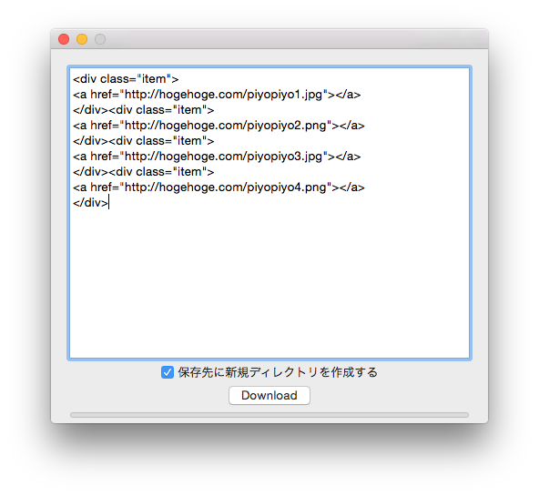

##概要
いちいち画像を保存するのが面倒なので、入力したHTMLから画像URLを抽出してダウンロードするMacアプリ

**Swiftの練習**

##使い方
1. GoogleChromeで保存したい画像をタブでたくさん開く
1. GoogleChromeExtentionの
[GetTabInfo](https://chrome.google.com/webstore/detail/gettabinfo/iadhcoaabobddcebhmheikmbcjcigjhc)
などを利用して全タブ(画像だけ)のURLのリストをHTMLで生成する
1. 本アプリに貼り付けて**Download**ボタン押す
1. 任意の保存先ディレクトリを選択すると、そこにUUIDなディレクトリを生成し保存される

##備考
エラーチェックとかあんまりしてないけどとりあえず動くのでよし

使ってる正規表現は`<a href="(.*)"`こんな